<p align="center">
  
</p>

<p align="center">
  
</p>

<p align="center">
  
  
  
  
</p>

```
// -----[ FIELD NOTES ]------------------------------------------------- //
```

```
$ whoami
> plutorion275 — MSc Data Science, VIT Chennai (2027)
> Building perception & sensing systems: computer vision, sensor fusion, embedded ML
> Currently deployed: Data Science Intern @ Bosch Global Software Technologies
> Prior ops: Accenture (churn modeling) · British Airways Data Team (flight KPI dashboards)
```

```
// -----[ SYSTEM SCAN ]-------------------------------------------------- //
```

<p align="center">
  
</p>

```
// -----[ ACTIVE DEPLOYMENTS ]-------------------------------------------- //
```

```
┌─ STREET SENSE ────────────────────────────────────────────────────────┐
│ Adaptive YOLOv8 traffic detection system, shipped with a cinematic    │
│ terminal presentation pipeline — ASCII-safe rendering, live terminal  │
│ responsiveness.                                                        │
└──────────────────────────────────────────────────────────────────────┘
```

<p>
  
  
  
</p>

```
┌─ RETROSENSE ───────────────────────────────────────────────────────────┐
│ Self-calibrating IMU framework — retrofit vehicle safety warnings via │
│ IMU, GNSS, and OBD-II fusion, with no OEM sensor access required.     │
│ Master's thesis project, in progress.                                  │
└──────────────────────────────────────────────────────────────────────┘
```

<p>
  
  
  
</p>

```
┌─ THE PEACEKEEPERS' ARMS RACE ───────────────────────────────────────────┐
│ Multi-source big-data pipeline testing the stability-instability      │
│ paradox — 6 datasets, 190+ countries, 1946-2024. Panel regression,    │
│ Granger causality, K-Means clustering with bootstrap validation.      │
└──────────────────────────────────────────────────────────────────────┘
```

<p>
  
  
  
</p>

```
// -----[ TELEMETRY ]------------------------------------------------------ //
```

<!-- the public github-readme-stats instance is best-effort; self-host on Vercel if it ever goes down -->
<table align="center" border="0">
  <tr>
    <td></td>
    <td></td>
  </tr>
</table>

<p align="center">
  
</p>

```
// -----[ TRANSMISSION LOG ]------------------------------------------------ //
```

<p align="center">
  
</p>

```
// -----[ COMMS ]------------------------------------------------------------ //
```

<p align="center">
  
  
</p>

<p align="center">
  <sub>// end of transmission //</sub>
</p>
